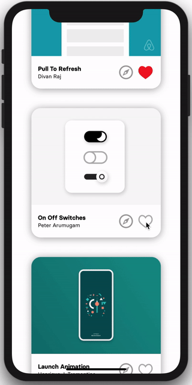

# Flow-Track
Flow, Animate Sketch designs. Master it with ❤️.

## Learn Flow

* Step 1: Get Up and Running with Flow
* Step 2: Preparing Your Design for Animation with Flow
* Step 3: Animate Your Design with Flow
* Step 4: Export Your Animation to Code with Flow
* Step 5: Integrate Your Animation Into an App with Flow

### Showcase

